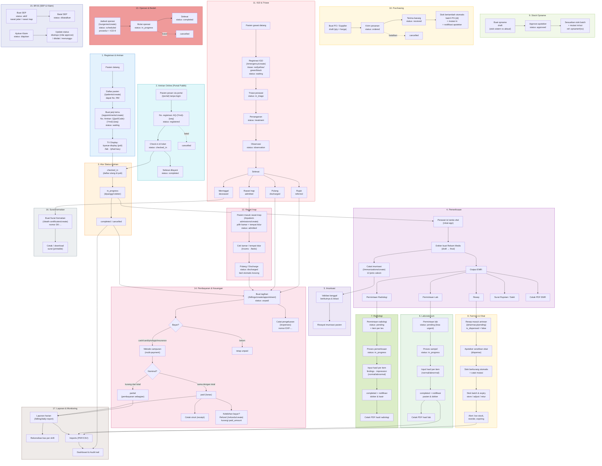

# Alur Bisnis HIS (Hospital Information System)

Diagram alur end-to-end sistem: dari pendaftaran pasien hingga laporan & audit, mencakup seluruh modul (rawat inap, IGD, operasi, lab, radiologi, farmasi, purchasing, keuangan, BPJS, imunisasi, stock opname, surat kematian, dan antrian online).

## Alur Singkat

1. **Registrasi** — pasien didaftarkan (No. RM), janji temu dibuat dengan No. Antrian otomatis per poli (`Q{poliCode}-{Ymd}-{seq}`).
2. **Antrian Online** — pasien memesan via portal publik (tanpa login), mendapat No. registrasi `AQ-{Ymd}-{seq}` (4 digit), lalu check-in di loket (`registered → checked_in → completed/cancelled`).
3. **Antrian** — pasien dipanggil: `waiting → checked_in → in_progress → completed/cancelled`, ditampilkan di TV display.
4. **Pemeriksaan** — perawat isi tanda vital, dokter buat EMR (draft→final) + resep/lab/radiologi/rujukan/surat sakit.
5. **Imunisasi** — perawat mencatat imunisasi (13 jenis vaksin) dengan validasi tanggal berikutnya.
6. **Laboratorium** — permintaan `pending → in_progress → completed`, hasil per item (normal/abnormal) + notifikasi.
7. **Radiologi** — permintaan `pending → in_progress → completed`, hasil per item (findings/impression) + notifikasi.
8. **Farmasi** — resep menunggu diserahkan (dispense), stok & mutasi otomatis berkurang, alert stok menipis/kedaluwarsa.
9. **Stock Opname** — opname `draft → approved`; saat approve stok batch disesuaikan + mutasi dicatat.
10. **Purchasing** — PO `draft → ordered → received/cancelled`; saat receive stok bertambah otomatis (batch `PO-{id}`).
11. **IGD & Triase** — `waiting → in_triage → treatment → observation` lalu `discharged / referred / admitted / deceased` (triase red/yellow/green/black).
12. **Rawat Inap** — pasien masuk (`admitted`) pilih kamar/bed, lalu `discharged` (bed otomatis kosong).
13. **Operasi & Bedah** — jadwal `scheduled → in_progress → completed/cancelled` (prosedur + ICD-9).
14. **Pembayaran** — tagihan dibuat, pembayaran bisa sebagian/penuh (multi-payment), plus refund bila kelebihan bayar dan pencatatan pengeluaran.
15. **BPJS** — SEP `aktif → dibatalkan`; Klaim `diajukan → disetujui/ditolak/menunggu`.
16. **Surat Kematian** — dibuat saat pasien meninggal (IGD/rawat inap), bisa dicetak/diunduh.
17. **Laporan** — laporan harian, rekonsiliasi kas, `/reports`, dashboard, dan audit trail.

## Status per Modul

| Modul | Status |
|---|---|
| Antrian (Appointment) | `waiting → checked_in → in_progress → completed / cancelled` |
| Antrian Online | `registered → checked_in → completed / cancelled` |
| Rekam Medis | `draft → finalized` |
| Laboratorium | `pending → in_progress → completed / cancelled` |
| Radiologi | `pending → in_progress → completed / cancelled` |
| Farmasi (resep) | dispense: `is_dispensed false → true` |
| Stock Opname | `draft → approved` |
| Purchase Order | `draft → ordered → received / cancelled` |
| Rawat Inap | `admitted → discharged / cancelled` |
| IGD & Triase | `waiting → in_triage → treatment → observation → discharged / referred / admitted / deceased` |
| Operasi | `scheduled → in_progress → completed / cancelled` |
| Tagihan (Billing) | `unpaid → partial → paid / cancelled` |
| SEP BPJS | `aktif → dibatalkan` |
| Klaim BPJS | `diajukan → disetujui / ditolak / menunggu` |