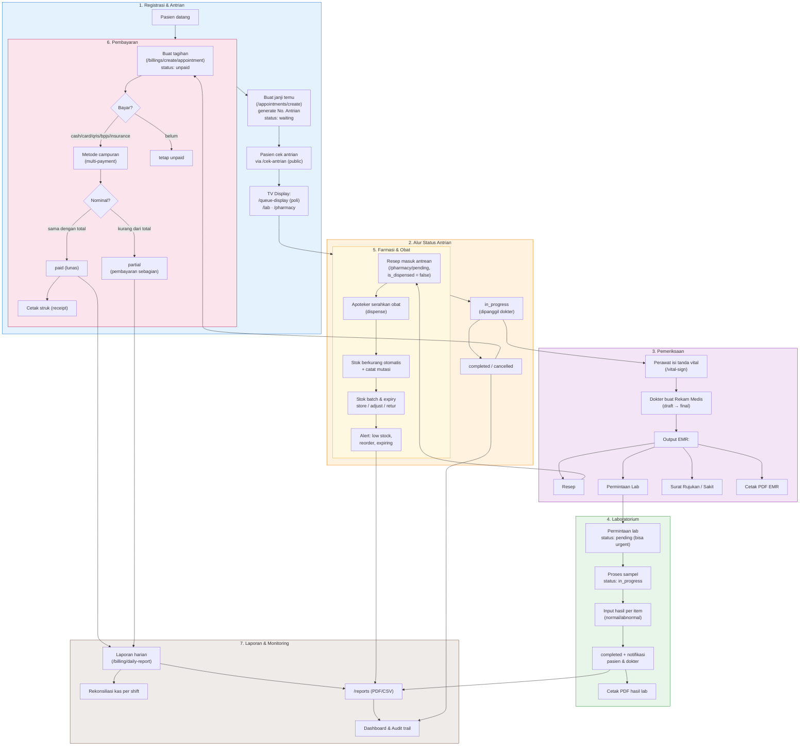

# Alur Bisnis HIS (Hospital Information System)

Diagram alur end-to-end sistem: dari pendaftaran pasien hingga laporan & audit.

## Alur Singkat

1. **Registrasi** — pasien didaftarkan (No. RM), janji temu dibuat dengan No. Antrian otomatis per poli.
2. **Antrian** — pasien dipanggil: `waiting → checked_in → in_progress → completed/cancelled`, ditampilkan di TV display.
3. **Pemeriksaan** — perawat isi tanda vital, dokter buat EMR (draft→final) + resep/lab/rujukan/surat sakit.
4. **Laboratorium** — permintaan `pending → in_progress → completed`, hasil per item (normal/abnormal) + notifikasi.
5. **Farmasi** — resep menunggu diserahkan (dispense), stok & mutasi otomatis berkurang, alert stok menipis/kedaluwarsa.
6. **Pembayaran** — tagihan dibuat, pembayaran bisa sebagian/penuh dengan metode campuran (cash/card/qris/bpjs/insurance).
7. **Laporan** — laporan harian, rekonsiliasi kas, `/reports`, dashboard, dan audit trail.